# Blade Surface Defect Detection with Machine Learning

This project focuses on detecting **surface defects on turbine blades** such as **nicks** and **scratches** using **Machine Learning** and **Transfer Learning** techniques. Early detection of these defects is critical to maintain efficiency, reduce maintenance costs, and improve the safety of turbine systems.

(To test out mlflow, switch to main_mlflow branch)

---

## 📌 Project Overview

Turbine blades operate at high speeds and play a crucial role in energy production. Over time, defects like scratches, nicks, or cracks may occur.

- These defects reduce aerodynamic efficiency and can cause energy loss.
- If left untreated, they may lead to blade breakage, resulting in downtime and safety risks.
- **Automatic defect detection** using ML ensures continuous monitoring and more reliable results compared to manual inspections.

---

## 🛠 Methodology

### 🔹 Dataset

- Source: [Kaggle - GKN Blade Surface Defect Dataset](https://www.kaggle.com/datasets/warcoder/gkn-blade-surface-defect-dataset)
- **Classes:**
  - Good: 203 images
  - Scratch: 149 images
  - Nick: 48 images

Example images from dataset:  
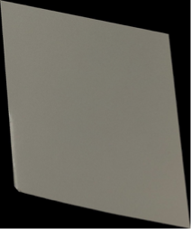 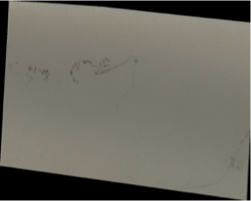 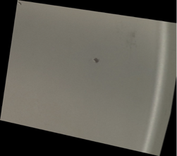

---

**Model**

- **EfficientNetV2-S** with additional layers
- **Transfer Learning** applied

**Training**

- Loss: `CrossEntropyLoss`
- Optimizer: `Adam (lr=1e-4, weight_decay=1e-5)`
- Batch size: 32
- Utilities: Early Stopping, LR Scheduler

**Evaluation**

- Multi-class classification report (precision, recall, F1-score)
- Accuracy: **90%**  
  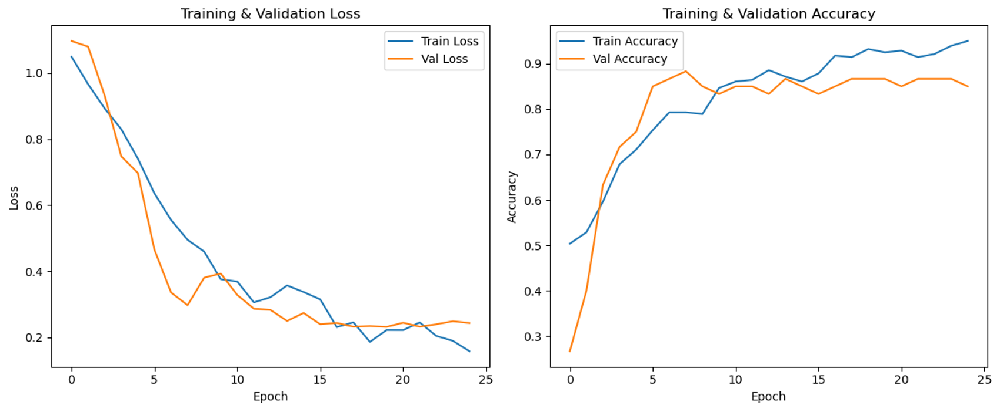
  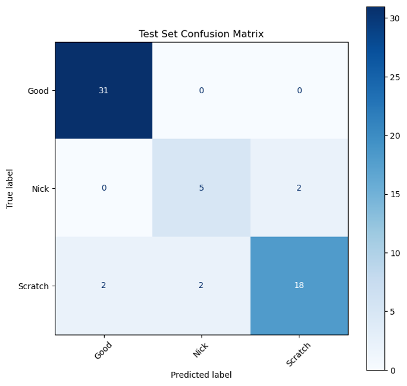
  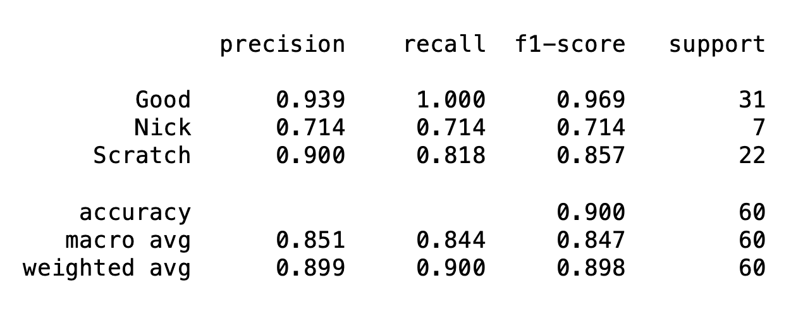

**Grad-CAM**

- Used for model interpretability  
  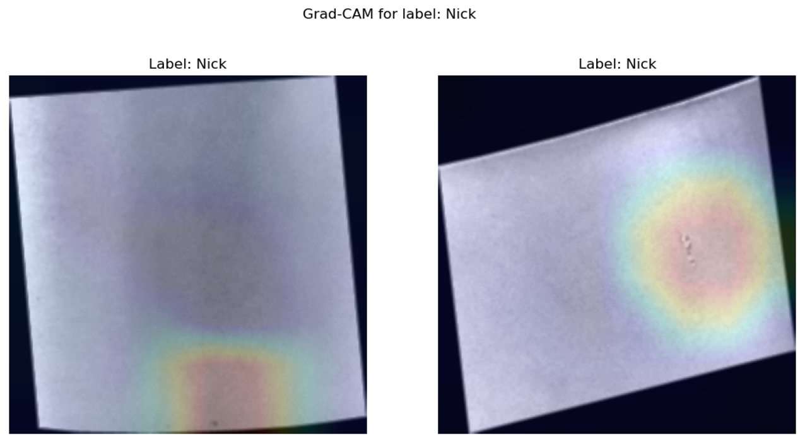
  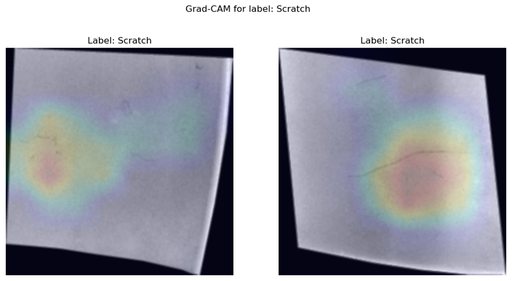

**Binary Classification**

- Combine nickked and scratched images to one label to reduce class imbalance
  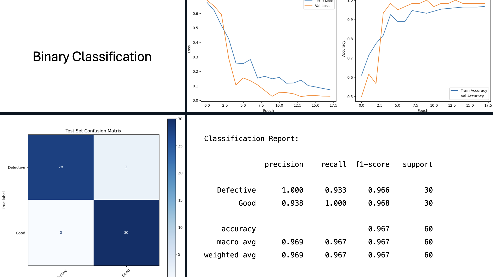

---

## 🌐 Web Application

A web-based interface was also developed for **classification** .

- Provides classification reports and Grad-CAM visualizations.  
  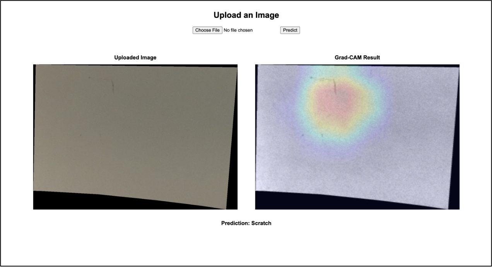

## Mlflow

Mlflow logging to track metrics and runs easly

- Logging parameters such as Learning rate , batch size, epoch
- Logging model metrics such as train and validation loss & accuracy
  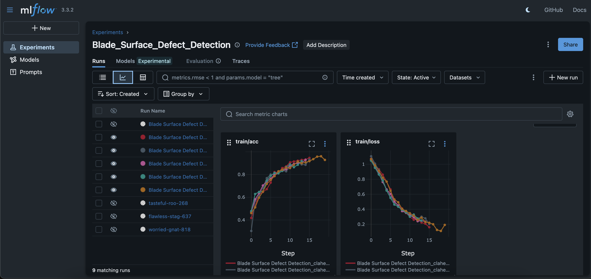

- Logging evalution metrics
  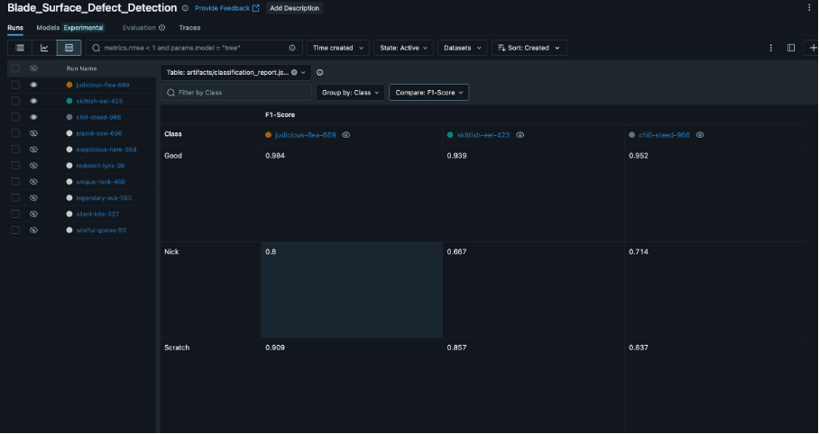

---

## 🚀 Key Features

- Automatic detection of turbine blade defects
- Transfer Learning with EfficientNetV2-S
- Class imbalance handling with augmentation
- Model interpretability via **Grad-CAM**
- Web application for real-time testing
- Logged parameters, metrics and evalutation scores to **Mlflow**

---

## 📊 Results

- **Multi-class classification:** ~90% accuracy
- **Binary classification:** ~97% accuracy
- Early detection of blade defects ensures cost savings, higher efficiency, and improved safety.

---

## 📌 Author

👤 **Ahmet Caner Tat**
